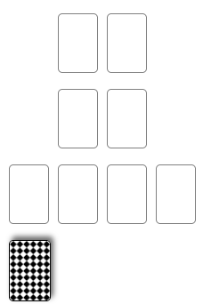

This repo contains an online implementation of a form of solitaire I've developed myself. I'm still workshopping this, so rule suggestions are welcome! To move a card, first click on the card you want to move, then click on the spot you want to move it to.

The game is played with a standard 54-card deck (52 cards plus jokers). The jokers act as wild cards and can be used for any value and either color. You have a hand of three cards, and setup is quick as everything else starts empty.

The four piles at the top are construction piles. The two on the left start at ace and count up; the two on the right start at king and count down. Cards may be played in any construction pile irrespective of suit. When two construction piles have all thirteen values between them, the piles are cleared and a point is scored. Any jokers in the piles are shuffled back into the deck, and the remaining cards are removed from play. The object of the game is to score four points.

The four spots along the bottom form the tableau. Cards may be moved freely within the tableau as in Klondike, or may be played into the construction piles. Cards from your hand may not be played on the tableau until the deck is empty.

If you have no legal moves or do not wish to make a move, you may reveal the top card in the deck. After doing so you must play that card. If the card cannot be played onto a construction pile, in must be placed on the tableau in the column aligned with the deck itself (even if that would otherwise be an illegal move). After playing the revealed card onto the tableau, the deck is moved over to the next column. Jokers from the deck cannot be played directly onto a construction pile, and must be played onto the tableau.
